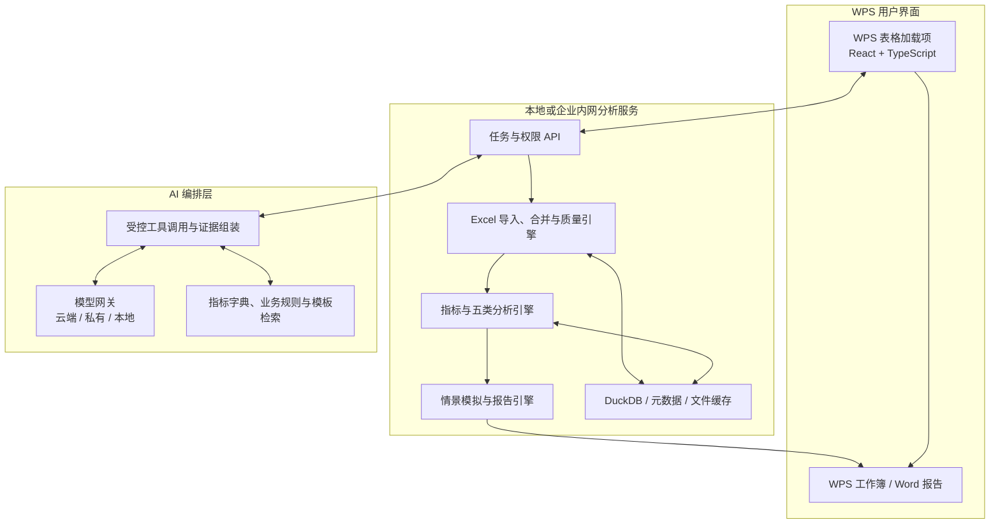

# DataMaster 产品规划与实施方案

> 版本：v0.4（个人在线版 + 本地分析版）  
> 日期：2026-07-11  
> 状态：双端可用版本已完成；桌面安装包按当前安排暂停打包  
> 产品定位：面向个人的 Excel/Word AI 经营分析桌面程序

> **当前实施基线（v0.4）**：首期仅面向个人效率，不建设企业账号、组织权限、集中审计或企业部署；本地后端采用 Spring Boot + Spring AI，在线版采用 Codex Sites + SIWC + D1。两端都支持 DeepSeek 与阿里云百炼，并按“平台 → 模型”配置。**不开发 WPS 加载项，也不依赖 WPS API**；WPS/Office 只负责打开导入文件和导出的 Excel、Word 文件。

> 说明：本文早期章节中关于 WPS 加载项、任务窗格和 WPS JSAPI 的内容属于历史备选路线，已被 v0.3 独立桌面程序路线取代，不进入当前 MVP。

> 文件范围说明：当前 Demo 支持 Excel/CSV 作为分析输入，并生成 Word 报告；Word 文档作为输入源的段落、表格解析列入下一阶段，不依赖 WPS 实现。

> 在线版本：`https://datamaster-analysis.odozidahe433.chatgpt.site`。Excel/XLS/CSV 文件在浏览器本地解析，不上传服务器；登录后可将 API Key 加密保存到 D1，并通过独立同步令牌与本地版同步配置。

> 桌面平台：仓库已预留桌面壳实验源码，但按当前安排暂不打包 macOS/Windows 安装程序；先以在线版和 `127.0.0.1` 本地版完成业务验收。

---

## 1. 执行摘要

DataMaster 不应被做成一个只会“对 Excel 聊天”的通用机器人，而应做成一个可审计、可复算、可落地的 **AI 经营分析桌面程序**：用户在程序中导入 Excel/CSV，系统完成多表合并、清洗、对账和确定性计算，再由 AI 解释经营结果、定位利润问题、模拟改善方案，并生成可继续编辑的 Excel 分析包与 Word 经营报告。

首期建议采用以下产品形态：

- **用户入口**：Windows 独立桌面程序，提供文件选择、拖拽导入、分析工作台和导出入口。
- **计算底座**：独立的本地分析服务，负责多表合并、数据质量、指标计算、异常检测和情景测算。
- **AI 能力**：负责字段理解、自然语言问答、归因解释、建议编排与报告写作；不直接替代确定性财务计算。
- **输出载体**：`.xlsx` 分析工作簿、`.docx` 经营分析报告、行动计划清单和完整证据链；文件可由 WPS 或 Microsoft Office 打开。
- **首期平台**：Windows 10/11 独立程序；不依赖 WPS 安装，不开发 WPS 插件。

核心设计原则：

1. **先算准，再讲清**：数字由代码和指标规则计算，AI 只基于已经核验的结果解释。
2. **结论有证据**：每个关键结论都能回溯到源文件、工作表、筛选条件、指标口径和计算过程。
3. **建议可执行**：建议必须包含优先级、预期影响、成本、风险、负责人、截止时间和验证指标。
4. **原始数据只读**：默认不覆盖源文件，自动修复、写回和外部模型上传都需要明确授权。
5. **人机共审**：AI 生成的是决策草案，不代替财务口径负责人和经营管理者做最终确认。

---

## 2. 产品目标与边界

### 2.1 产品目标

- 将“收集 Excel → 合并清洗 → 核对数据 → 计算指标 → 找原因 → 写 Word 报告”的重复流程自动化。
- 覆盖经营、产品、利润、客户、成本五类核心分析。
- 对亏损、毛利下滑、收入异常、客户流失、成本超支等问题给出量化归因和改善建议。
- 让业务人员以自然语言使用分析能力，同时保留专业人员所需的指标口径和明细下钻。
- 将一次性分析沉淀为可复用模板，支持月度、季度和年度滚动更新。

### 2.2 首期明确不做

- 不替代 ERP、财务核算系统或法定财务报表系统。
- 不允许 AI 在缺少数据时编造原因、数字或市场事实。
- 不自动执行调价、裁员、采购变更等真实经营动作。
- 不在首期承诺兼容所有 VBA、复杂宏、外部链接、特殊插件和历史 Excel 边缘格式。
- 不将“所有行业、所有公司的指标口径”硬编码成唯一标准；口径必须可配置、可审批、可版本化。

---

## 3. 目标用户与典型任务

| 用户角色 | 主要诉求 | DataMaster 提供的价值 |
|---|---|---|
| 财务 BP / 经营分析人员 | 月度经营分析、预算差异、利润归因、报告编写 | 自动合表、对账、利润桥、报告初稿和证据链 |
| 产品 / 商品负责人 | 产品收入、销量、毛利、结构和生命周期分析 | 产品组合、价格销量结构分析、低效 SKU 识别 |
| 销售 / 客户运营负责人 | 客户贡献、流失、集中度、回款和服务成本 | 客户分层、留存与风险分析、客户利润分析 |
| 成本 / 供应链负责人 | 采购、制造、履约、费用及单位成本变化 | 成本拆解、标准与实际差异、异常成本定位 |
| 部门负责人 / 管理层 | 快速理解结果、原因、风险和下一步动作 | 一页经营摘要、情景模拟、行动计划与跟踪 |
| 系统管理员 / 口径负责人 | 权限、模板、指标定义、模型和审计 | 统一口径、权限控制、版本记录和使用审计 |

### 3.1 高频工作场景

1. 每月收到多个部门、区域、门店或渠道 Excel，按统一字段追加合并。
2. 将销售表、成本表、预算表、客户表按订单号、产品编码或客户编码关联。
3. 一键生成收入、毛利、费用、利润、同比、环比、预算差异和结构分析。
4. 追问“为什么本月亏损”“哪个产品或客户拖累最大”“要做到盈亏平衡还差多少”。
5. 调整价格、销量、产品结构、采购成本或费用假设，模拟改善后的利润。
6. 将已确认的分析自动排版为 WPS 表格和 Word 报告，并生成责任到人的行动清单。

---

## 4. 产品功能蓝图

| 模块 | 核心能力 | 主要输出 |
|---|---|---|
| 数据工作台 | 批量导入、多表识别、追加/关联/汇总合并、字段映射、清洗、去重、异常隔离 | 标准数据集、数据质量报告、合并与对账记录 |
| 指标中心 | 指标定义、维度定义、公式、单位、期间、口径版本、审批状态 | 统一指标字典、可复算指标结果 |
| 经营分析 | 实际/预算/同期对比、趋势、结构、贡献度、区域/渠道/组织下钻 | 经营驾驶舱、异常清单、经营摘要 |
| 产品分析 | 收入/销量/毛利、价格-销量-结构、ABC、产品组合、低效 SKU | 产品矩阵、结构优化建议、重点产品清单 |
| 利润分析 | 毛利与经营利润、利润桥、盈亏平衡、敏感性和情景模拟 | 利润归因、扭亏路径、目标差距 |
| 客户分析 | 客户分层、RFM、留存/流失、集中度、信用与回款、服务成本 | 客户价值分层、风险客户、保留和提效建议 |
| 成本分析 | 固定/变动成本、直接/间接成本、单位成本、标准/实际差异、分摊 | 成本树、差异归因、降本机会池 |
| AI 分析助手 | 自然语言提问、异常解释、归因编排、建议生成、报告成文 | 有证据的回答、建议卡片、报告草稿 |
| 报告与行动 | Excel/Word 模板、图表、批注、行动项、审批和版本 | 分析工作簿、经营报告、行动计划与复盘 |

---

## 5. 端到端工作流


### 5.1 用户操作体验

1. 用户点击 WPS 功能区中的“DataMaster 分析”。
2. 选择当前工作簿、一个文件夹或多个 Excel 文件。
3. 系统展示识别出的表头、数据类型、主键候选和字段映射建议。
4. 用户选择“追加合并”或“按关键字段关联”，并预览匹配率与异常项。
5. 系统生成质量报告；核心金额或行数未通过对账时，阻止正式分析并说明原因。
6. 用户选择分析模板，例如“月度经营分析”或“亏损扭亏分析”。
7. 系统完成指标计算，AI 在右侧任务窗格解释异常并允许连续追问。
8. 用户调整情景假设、选择建议并确认。
9. 系统生成新的 Excel 分析包和 Word 报告，不覆盖原始文件。

---

## 6. 数据合并与数据质量设计

### 6.1 支持的合并方式

- **纵向追加**：多个区域、月份、门店或业务单元使用相似字段的表格按行合并。
- **横向关联**：销售、产品、客户、成本、预算等表按一个或多个业务键关联。
- **汇总合并**：先按指定维度聚合，再与另一张表关联，避免一对多导致金额重复。
- **文件夹批处理**：保存导入规则后，下个月只需替换或新增文件即可刷新。
- **工作表选择**：按名称、名称模式、表头特征或用户选择读取指定 Sheet。

### 6.2 智能字段映射

系统综合字段名、样例值、数据类型、单位和历史映射给出建议，例如将“客户编号”“客户ID”“cust_code”映射到统一字段 `customer_id`。AI 可以解释建议，但映射关系必须由用户确认后保存为版本化模板。

### 6.3 合并前强制检查

- 文件是否损坏、加密、空表或存在不支持的格式。
- 表头所在行、重复表头、合并单元格和尾部合计行。
- 日期、数字、文本、百分比、币种和税率的类型一致性。
- 主键唯一性、一对多/多对多关系和预计匹配率。
- 重复行、空值、异常值、负数、跨期数据和编码前导零。
- 输入行数、输出行数、过滤行数、重复行数和异常隔离行数。
- 合并前后收入、成本、数量等控制总额是否一致。

### 6.4 数据血缘

每条输出记录至少保留以下隐藏或元数据字段：

- 源文件 ID、文件名与文件哈希。
- 源工作表、源行号和导入时间。
- 使用的字段映射版本、清洗规则版本和合并任务 ID。
- 自动修复内容、原值、新值和确认人。

---

## 7. 指标中心与分析口径

### 7.1 建议的标准数据模型

核心事实表：

- `fact_sales`：订单、日期、客户、产品、数量、标价、折扣、净收入、税额。
- `fact_cost`：产品/订单/部门、直接材料、直接人工、履约、渠道、服务及其他成本。
- `fact_expense`：期间费用、成本中心、固定/变动属性、可控/不可控属性。
- `fact_budget`：预算或目标的期间、组织、产品、客户、收入、成本与利润。
- `fact_receivable`：应收、回款、账龄、逾期和信用信息（如首期样本具备）。

核心维度：日期、组织、区域、渠道、产品、客户、销售人员、供应商、项目、币种和成本中心。

### 7.2 首期核心指标

指标公式必须可配置，并标注含税/不含税、权责/收付、币种、分摊规则及适用期间。建议默认口径如下：

- 净收入 = 销售收入 - 折扣 - 退货（税务口径按企业规则配置）。
- 毛利 = 净收入 - 销售成本。
- 毛利率 = 毛利 ÷ 净收入。
- 边际贡献 = 净收入 - 变动成本。
- 边际贡献率 = 边际贡献 ÷ 净收入。
- 经营利润 = 毛利 - 销售费用 - 管理费用 - 研发费用 - 其他经营费用。
- 盈亏平衡收入 = 固定成本 ÷ 边际贡献率。
- 客户贡献利润 = 客户净收入 - 产品成本 - 渠道/履约/服务等可归属成本。

所有除法都必须处理零分母，金额展示精度、汇率和四舍五入规则由指标字典统一管理。

### 7.3 五类分析的标准输出

#### 经营分析

- 本期、预算、上期和去年同期对比。
- 同比、环比、预算差异、完成率、趋势和移动平均。
- 组织、区域、渠道、产品和客户的结构占比与贡献度。
- 异常变动排名、下钻明细和管理层摘要。

#### 产品分析

- 收入、销量、单价、折扣、毛利和毛利率。
- 价格、销量和产品结构（PVM）对收入/利润变化的影响。
- ABC 分类、增长-毛利矩阵、低销量低毛利 SKU 和负毛利产品。
- 新品、成熟品、衰退品的生命周期观察（前提是有足够历史数据）。

#### 利润分析

- 从预算/同期利润到本期利润的瀑布桥。
- 收入、销量、价格、产品结构、单位成本、固定成本和费用的量化贡献。
- 盈亏平衡点、目标利润差距、敏感性分析与多情景模拟。
- 亏损单元、利润池和改善机会排序。

#### 客户分析

- 收入、毛利、贡献利润、客单价、购买频次和最近交易。
- RFM 或企业自定义分层、留存、复购、流失预警和新老客户变化。
- Top 客户集中度、负贡献客户、折扣异常、回款/账龄风险。
- 客户价值与服务成本的二维分层。

#### 成本分析

- 直接/间接、固定/变动、可控/不可控成本分类。
- 单位成本趋势、标准与实际差异、采购价差、用量/效率差异。
- 按产品、订单、客户、组织、供应商和成本中心下钻。
- 成本分摊规则、分摊前后对账和高影响降本机会。

---

## 8. “亏损扭亏”分析引擎

这是 DataMaster 最有业务价值、也最需要严谨控制的核心场景。

### 8.1 诊断流程

1. **验证是否真的亏损**：确认期间、币种、税务口径、一次性项目、成本分摊和缺失数据。
2. **确定亏损范围**：按月份、组织、产品、客户、渠道和区域找到亏损集中点。
3. **建立利润桥**：量化价格、销量、结构、单位成本、固定成本、费用和异常项目的影响。
4. **识别根因候选**：将异常下钻到订单、SKU、客户、供应商或成本中心，并区分数据事实与业务推断。
5. **生成改善杠杆**：调价、折扣治理、产品组合、客户策略、采购降本、良率/效率、履约、产能和费用控制。
6. **情景模拟**：用户输入可控变量和约束，计算保守、基准、进取三类情景。
7. **形成行动计划**：按预期利润影响、实施难度、所需现金、风险和见效时间排序。
8. **跟踪与复盘**：保存基线、目标、负责人、截止时间和实际结果，供下期复盘。

### 8.2 建议卡片格式

每条建议统一包含：

- **发现**：明确的数据事实和影响金额。
- **证据**：来源表、筛选范围、指标口径和关键明细。
- **根因判断**：系统推断及置信程度；数据不足时明确标记待验证。
- **建议动作**：可执行的业务措施，而不是“加强管理”之类空泛表述。
- **预计影响**：测算公式、假设、利润改善区间和达成时间。
- **代价与风险**：销量流失、客户体验、现金投入、供应风险或组织影响。
- **负责人和验证指标**：建议责任角色、完成日期、领先指标和结果指标。

### 8.3 必须遵守的约束

- AI 不直接心算财务指标；全部金额和比例来自分析引擎。
- 结论必须区分“事实”“推断”“建议”。
- 缺少销量、单位成本、价格、预算等必要信息时，明确说明无法完成哪一层归因。
- 情景结果是基于假设的模拟，不包装成必然收益。
- 涉及裁员、授信、重大调价等高影响措施时，必须显示风险并要求人工审批。

---

## 9. WPS 表格与 Word 的深度集成设计

### 9.1 WPS 表格加载项

建议在功能区提供以下入口：

- 导入与合并
- 数据质量
- 刷新分析
- AI 问数
- 亏损诊断
- 情景模拟
- 生成报告
- 指标与设置

任务窗格建议包含“数据、分析、对话、建议、导出”五个页签。用户选择工作表、区域、图表或某个指标后，任务窗格应自动带入上下文。

### 9.2 自动生成的工作表

| 工作表 | 内容 |
|---|---|
| `DM_Readme` | 本次任务说明、数据期间、版本和操作入口 |
| `DM_DataQuality` | 文件、字段、异常、匹配率和对账结果 |
| `DM_Metrics` | 指标值、口径、单位、期间和来源 |
| `DM_Dashboard` | 管理层关键指标、趋势、结构和异常图表 |
| `DM_Analysis` | 五类分析的表格与下钻入口 |
| `DM_Turnaround` | 亏损归因、利润桥、情景和扭亏路径 |
| `DM_ActionPlan` | 行动、影响、负责人、日期、状态和复盘结果 |
| `DM_Audit` | 数据、规则、AI 和人工确认记录 |

### 9.3 Word 报告

Word 报告采用企业模板生成，并保留可编辑性。建议标准结构：

1. 管理层摘要。
2. 核心经营结果。
3. 收入与产品分析。
4. 利润与成本分析。
5. 客户分析。
6. 主要风险和机会。
7. 改善建议与行动计划。
8. 数据口径、假设和附录。

图表应优先由确定性分析结果生成；AI 负责标题、摘要和段落表达。正式报告生成前展示预览与引用检查。

### 9.4 WPS 官方能力与技术判断

- WPS 官方将加载项定义为基于 Web 技术扩展 WPS 的方案，可通过 JavaScript 与 WPS 应用交互，并提供功能区、任务窗格和 Web 对话框，适合首期的桌面深度集成。官方资料当前明确提到 Windows/Linux 适配，因此 **目标 WPS 版本和操作系统必须在第 0 阶段实机验证**。
- WPS 官方说明从 12.1.0.16910 起，旧的 `oem.ini/jsplugins.xml` 加载方式受到限制；交付时应验证并采用当前推荐的 `wpsjs publish` 发布方式，不能照搬旧教程。
- WPS WebOffice SDK 可在网页中嵌入文档，并通过 `Application` API 操作文档，适合后续的企业门户与多人协作版，但需要接入回调服务、文件存储和权限体系。
- 公网 WebOffice 的文件回调需要由接入方实现并可被其服务访问，因此它不能直接当作“完全离线内网方案”；纯内网使用需另行确认 WPS 私有化产品与授权。
- WPS 365 OpenAPI 可用于企业云文档、身份和权限等集成，但企业自建应用需要企业账号、权限申请和访问凭证，不应作为个人版 MVP 的强依赖。
- `.xlsx` 和 `.docx` 作为首期主交付格式；`.xls` 可以导入，但复杂宏、外部链接和特殊对象需单独列入兼容清单。

---

## 10. AI 能力设计

### 10.1 AI 应做什么

- 识别表头、业务含义、单位和候选字段映射。
- 将自然语言问题转成受控的分析意图、维度、指标、筛选和期间。
- 基于结构化分析结果组织归因链、风险提示和管理层摘要。
- 检索企业指标口径、业务规则、报告模板和历史复盘经验。
- 生成 Word 报告草稿、图表标题、批注和行动计划。
- 对数据不足、口径冲突和异常结果主动提出验证要求。

### 10.2 AI 不应做什么

- 不直接读取一堆单元格后凭语言模型计算利润。
- 不执行任意 SQL、Python、文件写入或外部请求；只能调用白名单工具。
- 不把工作簿中的文字当作系统指令，防止提示词注入。
- 不在未经同意时把客户、价格、成本等敏感明细发送到外部模型。
- 不将预测或建议描述成确定事实。

### 10.3 AI 输出协议

AI 与分析引擎之间使用结构化协议，而不是自由文本传递数字。建议输出字段包括：

- `intent`：分析意图。
- `metrics`、`dimensions`、`filters`、`period`：查询定义。
- `facts`：已经由引擎计算并带证据 ID 的事实。
- `inferences`：基于事实的推断、置信度与待验证条件。
- `recommendations`：行动、优先级、假设、预计影响、风险和验证指标。
- `citations`：数据集、源文件、工作表、指标版本和查询 ID。

### 10.4 模型策略

建立统一 AI Gateway，支持按企业要求切换：

- 云端大模型：适合高质量归因、复杂报告和多轮问答。
- 企业私有模型：适合强合规环境。
- 本地模型：适合敏感数据摘要、分类或断网场景，但复杂推理能力需实测。

模型不是业务口径的存储位置。指标、规则、提示模板、评测集和输出 Schema 都必须保存在项目中并版本化。

---

## 11. 推荐技术架构



### 11.1 前端与 WPS 侧

- TypeScript + React + Vite 构建任务窗格。
- 使用 WPS 加载项 JSAPI / `wpsjs` 实现功能区、选区读取、结果写回和对话框。
- 大数据处理不在加载项渲染线程内执行，避免 WPS 卡顿。
- 对当前工作簿的任何写入先生成预览或新 Sheet，并提供撤销/重新生成。

### 11.2 本地分析服务

建议以 Python 服务作为首期数据与 AI 后端：

- FastAPI + Pydantic：本地 API、任务状态与结构化契约。
- Polars 或同类列式引擎：批量清洗、连接、聚合和大表处理。
- DuckDB + Parquet：本地分析查询、列式快照、缓存和可复现数据集。
- Excel 读写库 + WPS JSAPI：读取标准文件、生成结果，并由 WPS 侧完成深度工作簿操作。
- `python-docx` / 模板引擎：生成可编辑 `.docx` 报告。
- 安装包将本地服务和依赖封装，不要求业务用户配置 Python 环境。

本地服务只监听 `127.0.0.1`，使用随机会话令牌、来源白名单和短期任务凭证。WPS 内嵌浏览器与本地服务之间的 HTTP/WebSocket、CORS 和启动流程必须进入第 1 阶段技术验证。

对于 `.et`、`.wps` 或复杂旧格式，优先由 WPS 另存临时 `.xlsx`/`.docx` 后再分析。对于 `.xlsm`/`.docm`，首期只读并保留原件，不自动执行宏，也不承诺第三方文件库修改后仍完整保留 VBA、透视缓存和外部链接。

具体库版本应在技术验证阶段根据中文格式、公式、图表、旧版文件和许可证要求确定。

### 11.3 数据存储

- 原始文件默认保留在用户指定目录，只读访问。
- DuckDB 保存本次分析所需的标准化数据或缓存；SQLite/同类轻量库保存配置、任务、权限和审计元数据。
- 指标字典、清洗规则、报告模板和 AI 提示模板使用可版本化文件或数据库记录。
- 企业版可将元数据和任务迁移到 PostgreSQL，对象文件迁移到企业对象存储。

### 11.4 两种部署模式

| 模式 | 适用场景 | 数据路径 | 特点 |
|---|---|---|---|
| 本地优先版 | 单人或小团队、敏感数据、快速落地 | WPS → 本机分析服务 → 可选 AI | 易试点，默认不集中存储数据 |
| 企业内网版 | 多用户、统一口径、权限与审计 | WPS/WPS 365 → 企业 API → 内网分析与模型网关 | 可集中治理、协作和接系统 |

建议先完成本地优先 MVP，同时预留 API 契约，避免未来企业化时重写分析核心。

---

## 12. 安全、权限与审计

### 12.1 数据安全模式

用户或管理员必须明确选择：

1. **完全本地**：数据和分析都不离开设备；仅使用本地模型或关闭 AI 生成。
2. **脱敏调用**：只将聚合指标、匿名维度和必要上下文发送给外部模型。
3. **企业私有**：数据发送至企业批准的私有模型或内网模型网关。

### 12.2 安全控制

- API 密钥进入系统密钥链或企业密钥服务，不写入代码、工作簿或配置模板。
- 支持客户名、手机号、证件号、地址、合同号等字段脱敏。
- 采用最小权限，区分查看、分析、模板管理、口径审批和系统管理。
- 对导入、规则变更、AI 调用、报告生成、写回和人工确认记录审计日志。
- 原始文件永不静默覆盖；输出使用新文件名和版本号，失败任务可恢复。
- 单元格、文档和外部文件中的文本均按不可信数据处理，不能改变系统规则或触发越权工具。
- 建立数据保留和删除策略，允许清除缓存、分析副本和 AI 会话记录。

---

## 13. MVP 范围与版本路线

### 13.1 MVP 必须包含

- 多个 `.xlsx`、`.xls`、`.csv` 文件的选择、预览和批量导入。
- 纵向追加、关键字段关联、字段映射模板、去重和异常隔离。
- 数据质量报告、主键匹配预览、行数与核心金额对账。
- 指标字典和经营、产品、利润、客户、成本五类标准分析。
- 同比、环比、预算差异、结构占比、贡献度和明细下钻。
- 亏损利润桥、盈亏平衡和三情景模拟。
- AI 问数、异常解释、扭亏建议、证据引用和数据不足提示。
- Excel 分析工作簿与 Word 报告输出。
- 原文件保护、操作日志、敏感数据模式和人工确认。

### 13.2 MVP 后增强

- 保存并定时刷新月度分析任务。
- 行动计划提醒、完成度和实际收益复盘。
- 多币种、复杂成本分摊和更多行业指标包。
- 预测、客户流失评分、异常预警和经营早报。
- WPS 365 云文档、企业身份、权限和多人协作。
- ERP、CRM、数据库和数据仓库连接器。
- 企业知识库、历史报告对比和跨期经验检索。

### 13.3 暂缓能力

- 全自动经营决策与执行。
- 无限制支持任意 Excel 宏、插件和公式环境。
- 首期即建设大型数据平台、复杂流程审批和移动端全功能应用。

---

## 14. 实施路线与阶段出口

以下周期以“已提供脱敏真实样表、指标负责人能及时确认口径”为前提；它是估算区间，不是固定承诺。

| 阶段 | 参考周期 | 主要交付物 | 阶段出口 |
|---|---:|---|---|
| 0. 需求与样本确认 | 3–5 个工作日 | 脱敏样表、指标字典、目标 WPS/系统版本、报告样稿、安全要求 | 首期范围和口径确认 |
| 1. 技术验证 | 1 周 | WPS 加载项原型、多表读取、选区交互、Excel/Word 导出 | 真实环境打开—编辑—保存—重开通过 |
| 2. 数据底座 MVP | 1–2 周 | 导入、字段映射、合并、清洗、质量报告、数据血缘 | 行数、金额、重复和匹配率可对账 |
| 3. 分析引擎 MVP | 2 周 | 五类分析、指标中心、利润桥、图表与下钻 | 黄金数据集结果全部通过 |
| 4. AI 分析助手 | 2 周 | 问数、异常解释、亏损归因、建议、证据和报告草稿 | AI 不编造数字，关键结论可追溯 |
| 5. WPS 与报告交付 | 1–2 周 | 完整加载项、分析工作簿、Word 模板、一键导出 | 目标 WPS 环境兼容测试通过 |
| 6. 试点与加固 | 2 周 | 性能、权限、审计、异常恢复、安装包和手册 | 真实用户独立跑通完整流程 |

在范围稳定时，内部 MVP 通常按 **6–8 周**规划，达到稳定生产使用按 **10–12 周**规划。复杂宏兼容、超大工作簿、私有模型部署或多系统集成需要单独增加时间。

---

## 15. 多 Agent 实施方案

### 15.1 能否在实施时启动多个子 Agent

可以。实施阶段可由主 Agent 负责任务拆解、接口约定、调度、审查和最终集成，同时让多个子 Agent 并行开发彼此独立的模块。

当前环境的实际边界是：

- 最多同时运行 4 个 Agent，包含主 Agent，因此常用编排是“1 个总控 + 3 个并行执行”；可以分多批次使用更多角色。
- 可以把角色命名为 Sol、Terra 等，但不能保证子 Agent 一定使用名为“5.6sol”或“5.6terra”的特定模型。当前可可靠控制的是角色、上下文、任务范围、工具权限和验收标准。
- 所有 Agent 共享当前工作区，因此必须实行目录/文件所有权，禁止同时编辑同一文件。
- 重要结论、接口和进度必须写入仓库，不能依赖某个 Agent 的临时记忆。

### 15.2 建议角色

| 角色 | 主要职责 |
|---|---|
| Sol / 总控 Agent | 需求、架构、任务分解、公共接口、代码审查、集成和最终验收 |
| Terra / 数据与 Excel Agent | 多表读取、字段映射、合并清洗、指标计算、数据血缘和 Excel 导入导出 |
| Orion / 分析与 AI Agent | 五类分析、亏损归因、建议引擎、证据引用、提示安全和 AI 评测 |
| Vega / WPS 与报告 Agent | WPS 加载项、任务窗格、表格写回、图表、Word 模板与兼容性 |
| Sentinel / 测试与安全 Agent | 黄金数据集、回归、性能、WPS 实机、AI 防幻觉、隐私与审计验证 |

第一批可由 Terra、Orion、Vega 并行开发；完成核心模块后，释放一个并发位并启动 Sentinel 做独立验收。Sol 全程维护接口、整合结果并重新运行测试。

### 15.3 多 Agent 工作规则

1. Sol 先写任务卡、接口契约、输入输出样例和验收条件，再启动子 Agent。
2. 每个 Agent 只修改其负责目录；公共模型、依赖锁文件和应用入口由 Sol 统一维护。
3. 原始样表只读；测试使用脱敏副本和版本化黄金数据集。
4. 子 Agent 交付必须同时包含代码、测试、测试结果、已知限制和变更说明。
5. Sol 不仅听取“已完成”的文字结论，必须检查差异并复跑测试。
6. 指标口径、清洗规则、报告模板和 AI 提示都进入版本控制。
7. 合并顺序固定为：公共契约 → 数据层 → 分析层 → AI 层 → WPS/报告 → 集成测试。

### 15.4 推荐项目结构

```text
DataMaster/
  apps/
    wps-addin/              # Vega：WPS UI 与交互
  services/
    analysis-api/           # 本地 API 与任务编排
  packages/
    ingestion/              # Terra：导入、合并、质量、血缘
    metrics/                # Terra：指标和确定性计算
    analytics/              # Orion：五类分析与情景模拟
    ai/                     # Orion：AI 编排、检索、证据与安全
    reports/                # Vega：Excel/Word 模板与输出
    contracts/              # Sol：公共 Schema 与接口契约
  templates/
    excel/
    word/
  tests/
    unit/
    integration/
    golden/                 # Sentinel：黄金数据和预期结果
    compatibility/
  docs/
    decisions/              # 架构决策记录
    metrics/                # 指标字典
    tasks/                  # Agent 任务卡与验收记录
```

---

## 16. 质量门与验收标准

### 16.1 数据与计算

- 每次导入都显示输入、输出、过滤、重复和异常行数。
- 合并前展示主键唯一性、关系类型和预计匹配率。
- 收入、成本、数量和利润可与源表控制总额对账。
- 所有指标来自版本化指标字典，并通过黄金数据集验证。
- 财务金额按业务精度校验；比例误差阈值由指标规则设定。
- 任意分析结论可以下钻到明细和来源。

### 16.2 AI

- 每条关键结论包含证据 ID 或明确的数据引用。
- 输出严格区分事实、推断和建议。
- 数据不足时说明缺少的字段或期间，不补造数字。
- 建议包含优先级、预计影响、假设、成本、风险和验证指标。
- 工作簿内的恶意提示文字不能改变系统指令或触发越权操作。
- 正式写回、报告发布和敏感数据外发前需要用户确认。

### 16.3 WPS 与文件兼容

- 在约定的 WPS 版本执行“打开—编辑—保存—重新打开”测试。
- 检查公式、数值格式、中文字体、合并单元格、图表、表格宽度和分页。
- `.xlsx` 与 `.docx` 为主验收格式；旧 `.xls` 和宏文件按兼容清单测试。
- 不支持的对象必须提示，不能静默丢失或错误转换。

### 16.4 MVP 业务验收

1. 用户可一次选择多个 Excel，并完成追加或按键关联。
2. 系统执行前展示字段匹配、重复键、匹配率和异常预览。
3. 合并后自动生成数据质量与金额对账报告。
4. 五类分析均输出指标、趋势、结构、异常和可下钻明细。
5. 对亏损场景量化主要驱动因素，并给出带影响测算和验证指标的扭亏建议。
6. AI 结论全部可追溯；不能确认的内容明确标记。
7. 结果可导出为 Excel 工作簿和 Word 报告，在目标 WPS 中正常使用。
8. 未经确认不覆盖源文件、不发布正式报告、不上传敏感数据。
9. 黄金数据、兼容性、AI 安全和性能测试通过。
10. 真实业务用户可在不依赖开发人员的情况下跑通“导入—合并—分析—建议—报告”。

### 16.5 建议的试点成效指标

- 月度经营分析总耗时比现状降低 60% 以上。
- 重复合表和格式整理人工耗时降低 80% 以上。
- 在约定的普通办公电脑上，典型 20 个文件、合计 50 万行的导入、合并和基础分析目标时间不超过 5 分钟；最终阈值以 P0 实测基线为准。
- 黄金数据集核心指标计算准确率 100%。
- AI 关键数字引用覆盖率 100%。
- 首轮数据导入失败时，用户能从质量报告定位问题，而非依赖开发人员查日志。
- 试点用户完整任务成功率达到 90% 以上，再进入扩大使用阶段。

---

## 17. 主要风险与应对

| 风险 | 应对措施 |
|---|---|
| WPS 接口与 Microsoft Office 不完全一致 | 第一周使用真实 WPS 版本做 PoC；文件格式和 JSAPI 两条路径并行保底 |
| 部门指标口径不一致 | 建立指标字典、口径负责人、审批状态和版本；报告显示所用版本 |
| Excel 表头和结构混乱 | 导入预览、映射模板、异常隔离、控制总额和规则复用 |
| 关联后金额重复 | 关系类型检测、主键唯一性检查、聚合后关联和合并前预览 |
| AI 结论看似合理但无依据 | 指标代码化、结构化事实输入、强制引用、黄金问答集和拒答机制 |
| 客户与成本数据泄露 | 本地优先、脱敏、最小化上传、模型白名单、权限和审计 |
| 大工作簿导致 WPS 卡顿 | 后台列式处理、分块读取、任务进度、缓存和目标设备性能基线 |
| 多 Agent 同时修改导致冲突 | 一 Agent 一目录、公共文件单一维护者、固定集成顺序和主 Agent 复核 |
| 功能范围失控 | 锁定首期五类分析、多表合并、亏损诊断和报告；其他需求进入后续版本 |

---

## 18. 启动实施前需要确认的输入

这些问题不阻塞产品规划，但会决定 MVP 的具体技术路线和排期：

1. 实际使用的操作系统、WPS 版本、个人版/企业版，以及是否已有 WPS 365 企业账号。
2. 每类至少 2–3 份脱敏真实样表：销售、产品、客户、成本、费用、预算和历史报告。
3. 核心指标的现有口径、计算公式、币种、税务处理、成本分摊和审批人。
4. 常见文件数量、单文件行数、最大工作簿大小和刷新频率。
5. AI 数据能否出网；允许的模型供应商、私有部署或完全本地要求。
6. 现有 Excel 分析模板、Word 报告模板和管理层偏好的图表风格。
7. 首期试点用户、实际业务周期和可量化的当前耗时基线。

---

## 19. 建议的下一步

建议下一阶段先做一个 **5 个工作日的“样本与 WPS 技术验证 Sprint”**，而不是直接全面编码：

1. 收集并脱敏 5–10 份代表性 Excel 和 1 份现有 Word 经营报告。
2. 确认首批 20–30 个指标和一套亏损案例的人工正确答案。
3. 在目标 WPS 环境验证加载项、选区读取、数据写回、图表和 Word 生成。
4. 跑通“3 个 Excel 合并 → 对账 → 利润分析 → 一条有证据的建议 → Word 报告”纵向原型。
5. 根据实测结果冻结 MVP 接口、兼容清单、验收集和正式排期。

完成这一步后，即可按第 15 节的 Sol / Terra / Orion / Vega / Sentinel 角色编排进入并行实施。

---

## 20. WPS 官方技术参考

- [WPS 加载项概述](https://open.wps.cn/documents/app-integration-dev/wps365/client/wpsoffice/wps-integration-mode/wps-addin-development/addin-overview)
- [WPS 加载项开发说明](https://open.wps.cn/documents/app-integration-dev/wps365/client/wpsoffice/wps-integration-mode/wps-addin-development/wps-addin-development-instructions)
- [WPS WebOffice SDK 概述](https://open.wps.cn/documents/app-integration-dev/docs-center/online-preview-edit/web/summary)
- [WPS WebOffice 原理概述](https://open.wps.cn/documents/app-integration-dev/docs-center/online-preview-edit/principle)
- [WPS WebOffice 支持格式](https://open.wps.cn/documents/app-integration-dev/docs-center/online-preview-edit/format)
- [WPS 开放平台概述](https://open.wps.cn/documents/app-integration-dev/guide/overview)
- [WPS 开放平台调用流程](https://open.wps.cn/documents/app-integration-dev/wps365/server/api-description/flow)
