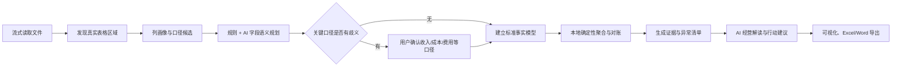

# DataMaster 通用报表 AI 分析修复方案

> 版本：v0.5 设计与验收基线  
> 日期：2026-07-13  
> 目标：修复“固定字段别名 + 缺失值补 0 + AI 只读失真摘要”的根本问题，使程序能在多种经营报表中先识别口径、再确定性计算、最后由 AI 给出有证据的经营解释。

> 范围说明：本文“本轮已实现”仅指 `backend/frontend/desktop` 本地源码；在线站点的数据引擎尚未完全同步本方案。

## 1. 本次问题的结论

用户提供的 6 月销售工作簿并不是普通汇总表，而是一张 91,751 行、76 个有效业务字段的超宽明细表。文件声明的使用范围被样式污染到 `XFD`，实际有效列只到 `BX`；同时包含大量公式、外部工作簿引用和公式错误。

旧版程序只可靠识别了“业务日期”和“金额”，没有识别“物料名称”“客户系统”“送货客户”“出库数量”以及多套成本、利润字段。缺失成本随后被当作 0，导致 6,279.03 万元收入被错误解释为近似等额利润，产品和客户也全部落入“未填写”。AI 接收到的只是这个已经损坏的摘要，因此无法自行纠正。

这不是针对某个文件补几个中文别名就能解决的问题。根治需要将导入、语义判断、指标计算和 AI 解读拆成可校验的独立阶段。

## 2. 新的分析流水线

### 2.1 结构发现

- 按非空内容和密度计算真实区域，不信任工作簿声明的 `dimension`。
- 支持单行表头、多行表头、合并表头、重复表头、尾部合计、明细表和汇总/交叉表。
- 保留源文件、工作表、源行号、列字母和表头层级，供证据回溯。
- 识别公式、缓存值、错误值、外部链接、注释、数字格式和前导零。
- 公式错误不转为 0；外链缓存值可以用于分析，但必须显示“可能陈旧”的风险。

> 当前实现使用 SAX 顺序读取 XLSX，并避开被空白样式放大的工作表范围，但仍把首个非空行作为单行表头。程序可报告外部工作簿链接，以及候选指标列中的不可解析数值或公式缓存结果；目前不能把公式错误与普通非法文本完全区分，也未提取公式模板、依赖关系、注释、合并表头或源行号。多行/合并表头与交叉表仍在规划中。

### 2.2 目标列画像与语义角色（本轮部分实现）

每列形成不含原始敏感明细的画像：

- 列 ID、规范化表头、表头层级、注释摘要；
- 日期/文本/金额/数量/百分比/编码等类型比例；
- 空值率、唯一值比例、正负数比例、最小/最大/分位数；
- 公式模板、依赖列和会计恒等关系候选；
- 候选角色、置信度、冲突项和需要确认的原因。

角色不是只靠精确别名判断，而是综合表头、类型、单位、分布、公式血缘和已确认模板。例如“物料编码”即使全是数字也应保留为分类编码；“毛利率”应识别为比例而非金额。

> 当前画像实际包含列标题、行数、非空数、数值数、覆盖率、最小值、最大值、均值、负数比例及受限的去重计数；表头层级、分位数、公式血缘、会计恒等关系和持久化映射模板尚未实现。

### 2.3 AI 的正确职责

AI 深度参与两个阶段，但不直接承担 9 万行金额加总。

1. **AI 字段理解**：根据脱敏列画像建议字段角色、候选口径和冲突关系，以严格 JSON 返回；程序校验列 ID、角色白名单和置信度。
2. **AI 经营解读**：只读取本地计算后的汇总、异常、贡献分析和证据 ID，解释驱动因素、提出可执行动作并说明假设。

字段理解会发送匿名列 ID、原始列标题、类型、覆盖率及数值分布，不发送文件名、工作表名、原始行或样例值。经营解读会发送精确聚合指标、匿名分组 ID 和证据 ID，不发送客户/产品实体名称或原始明细。列标题和聚合金额仍可能属于敏感业务信息，使用者应自行评估所选模型平台。模型不可用、响应格式错误或证据无效时，程序会明确失败并保留本地分析，不能伪装成 AI 成功。

## 3. 指标口径与能力门控

### 3.1 竞争口径必须确认

同一报表可能同时存在含税/不含税、调整前/调整后、生产成本/调拨成本、总毛利/贡献毛利等多套指标。程序必须：

- 展示收入、成本和报表利润候选、推断含义、置信度、位置、覆盖率和冲突；公式关系与金额影响展示属于后续规划；
- 允许用户选择本次分析口径并重新计算；
- 当前选择可在本次重新上传计算中复用；跨文件、跨会话的持久化映射模板属于后续能力；
- 禁止把竞争成本相加，也禁止为了生成利润而静默挑选一列。

### 3.2 能力门控

| 已确认数据 | 可启用分析 | 必须禁用或提示 |
|---|---|---|
| 收入 | 销售规模、结构、产品/客户/区域/渠道贡献 | 毛利、经营利润、扭亏 |
| 收入 + 成本 | 毛利、毛利率、负毛利对象、贡献分析 | 经营利润、盈亏平衡（缺期间费用） |
| 收入 + 成本 + 期间费用 | 经营利润、利润率、费用归因 | — |
| 单一期间 | 当期结构和异常 | 环比、同比、趋势结论 |
| 两个及以上期间 | 顺序比较 | 当前尚未校验月份连续性，也没有完整同比基期判断；存在断档时不能宣称严格环比或同比 |

缺失值与真实的 0 必须区分。能力不足时，界面不显示伪造的 0 元 KPI，而应解释还缺什么字段。

同一行中收入有效但成本公式报错时，不能用“有效收入 - 0 成本”计算利润。收入规模可以按全部有效收入展示，但毛利、贡献和利润率必须基于相关指标同时有效的可比行计算，并同时披露覆盖率、排除行数及排除金额影响；覆盖不足时应降级为风险提示而非强结论。

## 4. 标准事实模型与动态分析

当前事实模型支持日期、产品、客户、送货客户、数量、收入、成本、费用，以及别名白名单内的区域、部门、销售组、渠道、业务状态和分类维度。产品编码、任意用户自定义维度和任意扩展指标尚未通用化。

分析结果不再只固定输出产品和客户两个榜单，而是按已识别维度动态生成：

- 产品、产品类别和产品形态；
- 客户系统、送货客户和客户分类；
- 区域、部门、销售组、渠道和业务状态；
- 已识别白名单维度及同类候选列的收入、成本、毛利/贡献、占比和异常。

每条关键结论分为三种类型：

- `FACT`：直接由确定性聚合得到；
- `CONTRIBUTION`：由本地归因/差异计算得到；
- `HYPOTHESIS`：AI 的业务解释假设，必须给出验证方法。

结论必须绑定现有证据 ID；不存在证据的数字、对象或原因应被拒绝。

## 5. 大文件与复杂工作簿策略

500 MiB 可以作为上传上限，但不是“任意 500 MiB 文件一定成功”的承诺。除压缩文件大小外，还需要限制和报告：

- 解压后的 XML 体积；
- 有效行数、列数、单元格数和公式数；
- 共享字符串、样式、外部链接和错误公式复杂度；
- 单次导入总量与本机可用资源。

`.xlsx` 使用磁盘暂存 + SAX 事件流；CSV 使用逐行解析。原始单元格采用流式读取，但后续图表、分组和导出仍需保留最多 100 万条规范化 `DataRow`，因此整体分析并非常量内存。旧版 `.xls` 继续采用更低上限，并建议转换为 `.xlsx` 或 CSV。

## 6. 桌面端交互要求

设计方向：面向个人经营分析人员的冷静、可信、精密桌面工作台；采用靛蓝/蓝紫主色与雾白中性色，橙红仅表达风险；以任务阶段和工作区分栏代替网页式长页堆叠。界面的识别特征是“口径信号带”，把字段确认、当前可用能力和证据状态连成连续流程。数据使用对齐良好的表格数字，动效只服务于状态切换和确认反馈。

1. 导入后先展示“字段理解与口径确认”，再进入经营结果。
2. 映射有歧义时，用候选卡解释原因；用户确认后对当前文件重新分析。
3. 顶部显示当前已启用的分析能力，不可用 KPI 不占位、不显示为 0。
4. 数据质量页突出公式错误、外链缓存、空白分类、负数和未映射列。
5. 经营页按维度动态展示排行、结构和异常；结论与建议放在页面内容最后。
6. 清空全部、单文件删除、重新导入和空数据状态继续保留。
7. “AI 字段理解”和“AI 经营解读”分别标记平台、模型、时间和状态。

## 7. 本次真实报表的正确边界

在用户确认指标口径前，程序可以安全完成：

- 日期范围、行数、产品、客户、数量和各业务维度识别；
- 收入候选、成本候选和报表利润候选及其覆盖率与冲突；
- 外部链接、公式错误和空白分类等质量风险；
- 仅基于已确认收入的销售结构分析。

这份文件没有明确的销售/管理等期间费用字段，因此即使选择了某套成本，也只能称为毛利或贡献分析，不能直接宣称经营利润，更不能基于伪造经营亏损给出“扭亏”方案。

## 8. 全阶段验收矩阵

| 场景 | 状态 | 验收重点 |
|---|---|---|
| 标准销售长表 | 已实现 | 自动识别日期/产品/客户/数量/收入/成本/费用，指标可复算 |
| 只有收入的简表 | 已实现 | 只启用销售分析，不出现利润 KPI |
| 多套收入/成本/利润宽表 | 已实现 | 返回候选与冲突，等待用户确认，不静默猜测 |
| 多行/合并表头 | 规划中 | 正确拼接层级并保留源列证据 |
| 汇总/交叉表 | 规划中 | 识别维度轴和指标轴，不按普通明细重复计算 |
| 多文件追加 | 部分实现 | 当前支持同结构文件合并与移除重算；跨文件映射协调和控制总额对账待完善 |
| 公式错误与外链 | 已实现基础风险提示 | 不转 0，风险可见；只能使用工作簿内缓存值，不能验证外部源是否最新 |
| 大型 XLSX/CSV | 已实现输入保护 | 流式读取、资源限制清晰、失败信息可操作；500 MiB 不等于分析和导出必定成功 |
| 恶意表头/提示注入 | 已实现 | 只作为数据处理，AI 输出受结构和白名单校验 |
| AI 不可用/非法响应 | 已实现 | 本地结果仍可用，不显示虚假 AI 来源 |

## 9. 完成标准

- 用户的 6 月报表不再被计算为 100% 利润，产品和客户不再全部为“未填写”。
- 未确认竞争成本或缺少期间费用时，不生成经营利润和扭亏结论。
- 用户可以在程序中看到并确认字段候选，确认后无需修改原文件即可重算。
- 至少覆盖标准长表、仅收入表、竞争口径宽表、公式错误表和多文件合并的自动化回归。
- AI 请求不含原始明细、文件名和客户/产品实体名称；字段标题、列画像和经营聚合值会按任务需要发送。AI 结论必须通过证据 ID 校验。
- 构建、后端测试、前端语法检查、真实报表回归和已配置 DeepSeek 实测全部通过后，才视为本轮完成。

## 10. 本轮交付边界

| 能力 | 本轮状态 |
|---|---|
| 标准长表、超宽明细表、多文件追加 | 已实现 |
| 陌生单行表头的列画像和 AI/手动映射 | 已实现 |
| 多套收入/成本竞争口径阻断与用户确认 | 已实现 |
| 可比行利润、覆盖率、排除行和影响金额 | 已实现 |
| 动态业务维度、头部收入与尾部毛利拖累 | 已实现 |
| AI 字段理解、聚合事实解读、证据 ID 校验 | 已实现 |
| 多行/合并表头自动拼接 | 规划中 |
| 交叉表、透视表、任意报表版式自动还原 | 规划中 |
| 税额、折扣、运费、报表利润等扩展指标统一聚合 | 规划中；AI 字段白名单已有部分语义名称，但尚未进入确定性事实模型 |
