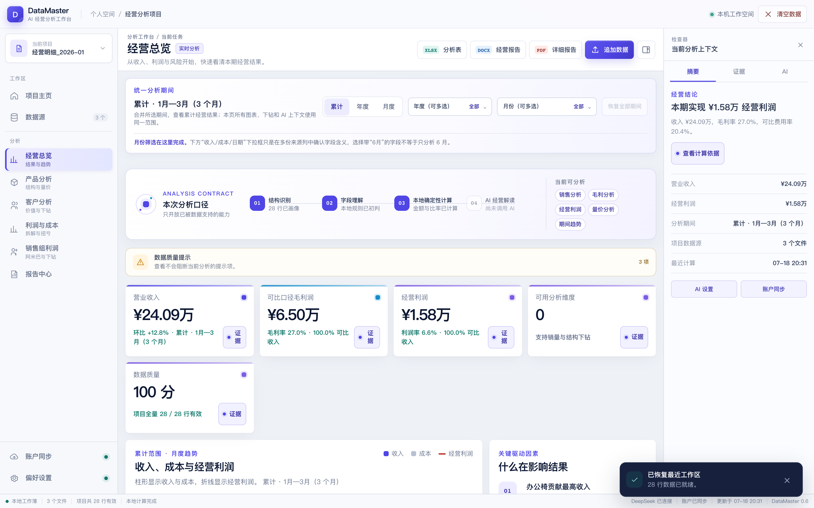
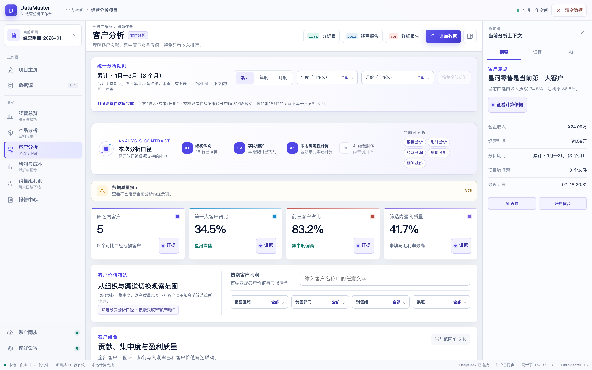

# DataMaster · AI 经营分析工作台

> Local-first business analysis for everyone: drop in Excel/CSV, get evidence-backed insights.

DataMaster 是一个**本地优先**的个人经营分析桌面应用。导入多份 Excel / XLS / CSV 后，自动完成合并、质量检查与字段识别，生成经营总览、产品、客户、利润与成本、销售组五个视角的分析结论、可复核的证据账本，以及 Excel 分析表、Word 经营报告和 PDF 详细报告。全部计算在本机完成，经营数据不出本机。



## 功能特性

- **多源导入与合并**：一次导入多个 `.xlsx` / `.xls` / `.csv`，自动跳过汇总型工作表，多文件统一口径合并；单文件最高 500 MiB，大文件 SAX 流式解析。
- **字段自动识别**：按中英文同义词自动映射日期、产品、客户、收入、成本、费用、数量、换算只数、调拨成本、规格型号、送货地址等常见字段；多套口径（未税/含税/调后）不会静默猜选，由你确认后才计算。
- **五个分析视图**：经营总览（KPI、趋势、驱动因素）、产品分析（结构透镜、量价拆解）、客户分析（集中度、价值明细、亏损清单）、利润与成本（结构、扭亏路径、动态维度）、销售组利润（阿米巴口径、双成本口径对照）。
- **数据驱动的维度下钻**：程序自动从数据中发现的层级关系（如 部门 → 区域 → 销售组、送货客户 → 送货地址、产品形态 → 规格型号）生成下钻入口，换一套表格就有一套新的下钻路径。
- **规格与明细**：产品规格型号自动带出（多规格标注"等 N 种"，悬浮查看全部变体）；长表格冻结表头，滚动自然衔接。
- **证据账本**：每条结论都挂证据编号，点击可回到确定性计算结果复核——AI 建议与确定性计算严格隔离。
- **AI 辅助分析**：支持 DeepSeek 与阿里云百炼（平台 → 模型两级配置）；AI 只做解读与建议，不改写数字；未配置模型时提供明确标注的本地规则建议。密钥 AES-GCM 加密保存在本机。
- **报告导出**：Excel 分析表、Word 经营报告、可选章节的 PDF 详细报告。
- **本地工作区**：自动保存文件索引、字段口径与分析状态，重启自动恢复；可单文件移除重算，也可一键清空。





> 截图使用演示样例数据（`demo/samples/`）。

## 下载

Windows x64 安装包（NSIS，含内嵌 Java 运行时，无需预装 Java）：见 [Releases](../../releases)。

安装后即可使用；程序只监听 `127.0.0.1`，不开放任何外部端口。

## 从源码构建

要求：**Java 17+、Maven 3.9+、Node.js 20+**。

```bash
# 1. 构建后端（前端静态资源会一并打入 jar）
cd backend && mvn package

# 2. 启动桌面应用（开发模式）
cd ../desktop && npm install && npm start
```

### 打包 Windows 安装包（macOS / Linux 上交叉构建）

```bash
# 1. 准备一份 Windows x64 JDK 17（仅需其 jmods），例如解压到 /path/to/winjdk
curl -L -o winjdk.zip "https://api.adoptium.net/v3/binary/latest/17/ga/windows/x64/jdk/hotspot/normal/eclipse"

# 2. 用本机 jlink 指向 Windows JDK 的 jmods 生成 Windows 运行时
cd desktop
"$JAVA_HOME/bin/jlink" \
  --module-path /path/to/winjdk/jmods \
  --add-modules java.base,java.compiler,java.desktop,java.instrument,java.logging,java.management,java.naming,java.net.http,java.prefs,java.rmi,java.scripting,java.security.jgss,java.security.sasl,java.sql,java.transaction.xa,java.xml,java.xml.crypto,jdk.crypto.ec,jdk.unsupported,jdk.zipfs \
  --strip-debug --no-header-files --no-man-pages --compress=2 \
  --output runtime-win-x64

# 3. 构建 NSIS 安装包（输出在 desktop/dist/）
npm run dist:win
```

macOS 本机调试运行时可用 `desktop/build-runtime.sh` 生成；`npm run dist:mac` 打包 macOS 目录/ DMG。

## 使用简介

1. **导入**：拖入或选择 Excel / CSV，支持多选与分批追加。
2. **确认口径**：出现多套收入/成本候选列时，在字段口径卡中选定后才会计算（原始文件不会被修改）。
3. **分析**：左侧切换五个视图；表格可搜索、筛选、多选合并、下钻；顶部可统一调整分析期间。
4. **AI**：左下角"偏好设置"配置 DeepSeek 或阿里云百炼的 API Key 后，可获得每页解读与对话建议；"账户同步"可把配置安全地同步到网页账户。
5. **导出**：工具栏导出 Excel 分析表、Word 经营报告或 PDF 详细报告。

## 隐私与安全

- 经营数据、Excel 文件、分析结果**只保存在本机**（`~/.datamaster/workspace`），不会上传云端。
- 后端仅监听 `127.0.0.1`；桌面壳与后端之间使用每次启动随机生成的令牌鉴权。
- AI 解读只发送经营摘要与匿名列画像，密钥加密保存且不回显。

## 项目结构

```
frontend/   分析前端（无框架：index.html / styles.css / app.js）
backend/    Spring Boot 分析引擎与 API（Java 17，前端静态资源打包进 jar）
desktop/    Electron 桌面壳（拉起后端、原生菜单、安全桥接）
demo/       演示脚本与示例 CSV
docs/       截图与方案文档
```

## 许可证

[MIT](LICENSE)
